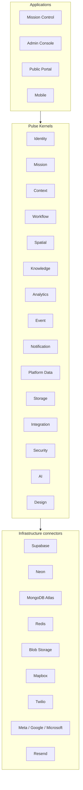
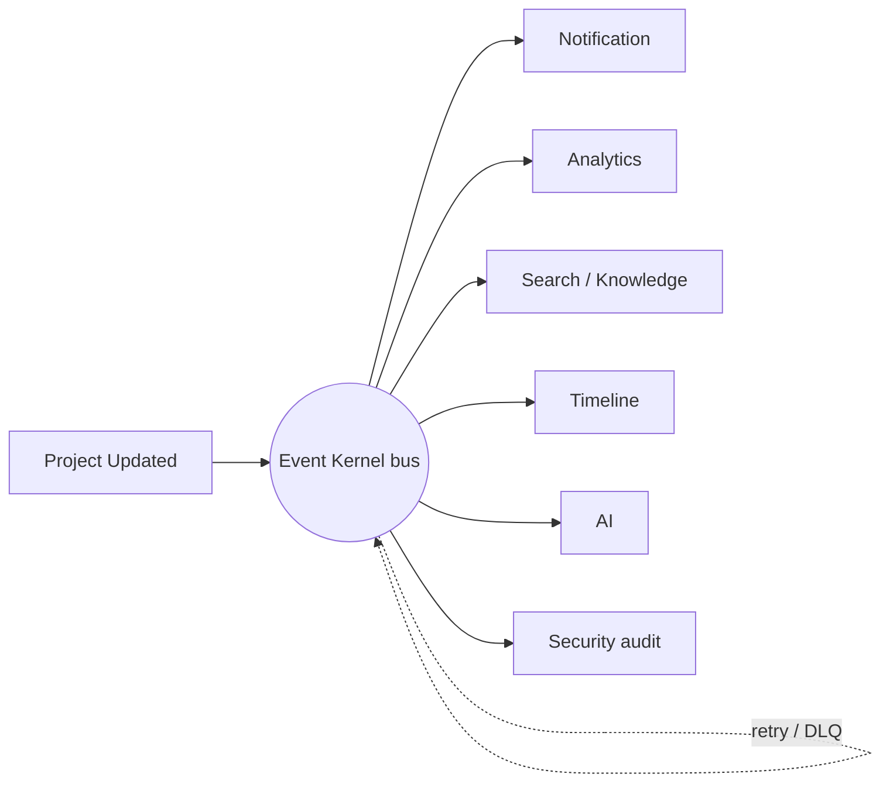
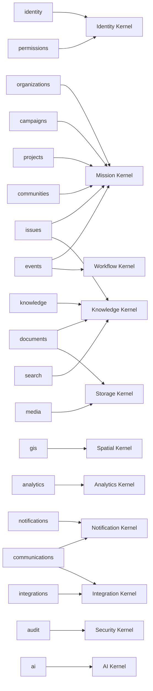

# Pulse Kernel Specification (Phase 2B.1.1)

**Status:** Architecture baseline — contracts + lifecycle implemented,
infrastructure deliberately mocked until phase 2B.1.4.

## Vision
Applications should be thin. Intelligence belongs inside the Kernel.

## Runtime layers
```text
Applications      Mission Control · Admin Console · Public Portal · Mobile
        ▲
Pulse Kernels     Identity · Mission · Context · Workflow · Spatial · Knowledge
                  Analytics · Event · Notification · Platform Data · Storage
                  Integration · Security · AI · Design
        ▲
Infrastructure    Supabase · Neon · MongoDB Atlas · Redis · Blob Storage
connectors        Mapbox · Twilio · Meta · Google · Microsoft · Resend
```
Nothing bypasses the kernel. Ever.

## Kernels
| Kernel | Purpose | Depends on |
| --- | --- | --- |
| Security | Encryption, secrets, policy, rate limits, audit | — |
| Platform Data | Repositories, transactions, cache, read/write models | security |
| Identity | Auth, sessions, RBAC/ABAC, membership, workspace switching | security, data |
| Context | Org / workspace / mission / geography / user / locale / theme / time | identity |
| Event | Domain events, queues, retries, dead letters | security |
| Mission | Organizations, workspaces, missions, programs, projects, communities | data, identity, context, event |
| Workflow | State machines, approvals, escalations, timers | event, mission, context |
| Knowledge | Indexing, versions, entity links, knowledge graph, RAG prep | data, storage, event |
| Spatial | Boundaries, layers, ingestion, spatial search, heatmaps | data, context, integration |
| Analytics | Aggregation, KPIs, trends, forecasts, summaries | data, event, context |
| Notification | Email, SMS, push, in-app, realtime | event, integration, context |
| Integration | Every external vendor behind one boundary | security, event |
| Storage | Documents, media, GIS, 3D, archives, versioning | security, data |
| AI | Prompt registry, embeddings, retrieval, context builder | knowledge, context, security |
| Design | Tokens, typography, color, spacing, motion, charts | context |

Each contract file declares `purpose`, `dependencies`, `publishes`,
`consumes` and `extensionPoints`, which are the machine-readable form of the
kernel contract checklist.

## Boot sequence
`resolveBootOrder()` topologically sorts the registry, producing:

```text
security → data → identity → context → event → mission → workflow → storage →
knowledge → integration → spatial → analytics → notification → ai → design
```

`bootKernel()` initializes modules in that order and hands each one a handle
that can resolve **only** its declared dependencies — an undeclared
`resolve()` throws. Shutdown drains the event bus, then tears modules down in
reverse order.

## Provider mode
`KernelConfig.providerMode` is `"memory"` through phases 2B.1.1–2B.1.3.
Unimplemented operations throw `NotImplementedYet` rather than silently
returning fake data, so gaps are explicit. Phase 2B.1.4 swaps adapters for
Supabase / Neon / MongoDB / Redis / blob storage without touching a single
domain or application module.

## Dependency rules (enforced or documented)
1. Applications may call only kernel APIs. *(convention + review)*
2. A kernel resolves only declared peers. *(enforced at boot)*
3. Dependency cycles are rejected. *(enforced by `resolveBootOrder`)*
4. Cross-kernel effects prefer the Event Kernel. *(convention)*
5. Adapters contain no business logic. *(convention + review)*

## Acceptance criteria status
- Documented contracts for every kernel — done.
- Explicit kernel dependencies — done, machine-readable.
- Applications depend only on kernel APIs — boundary established.
- Platform boots with mocked infrastructure — `bootKernel()` boots 15 modules.
- Real infrastructure attachable later without domain changes — adapter seam.

## Layer diagram



## Boot sequence diagram


## Event flow — nothing calls anything directly



## Domain contract modules mapped to kernels

19 domain contract modules live under `src/services/*/contracts.ts`. Each one
is a *bounded context* whose schemas must be consumed through exactly one
owning kernel.

| # | Domain module | Owning kernel | Relationship |
| --- | --- | --- | --- |
| 1 | `identity` | Identity | direct — profiles, sessions |
| 2 | `permissions` | Identity | folds in — role grants are `PermissionEngine` inputs |
| 3 | `organizations` | Mission | direct — tenant root |
| 4 | `campaigns` | Mission | projection — missions of type `campaign` |
| 5 | `projects` | Mission | direct — projects under programs |
| 6 | `communities` | Mission | direct — constituency grouping |
| 7 | `issues` | Mission + Knowledge | mission-owned records, knowledge-indexed |
| 8 | `events` (calendar) | Mission + Workflow | scheduling belongs to Workflow timers |
| 9 | `documents` | Knowledge + Storage | metadata to Knowledge, bytes to Storage |
| 10 | `knowledge` | Knowledge | direct |
| 11 | `search` | Knowledge | folds in — search is a Knowledge capability |
| 12 | `media` | Storage | direct — assets and versions |
| 13 | `gis` | Spatial | direct — features, layers, boundaries |
| 14 | `analytics` | Analytics | direct — track + query |
| 15 | `notifications` | Notification | direct — in-app / push / realtime |
| 16 | `communications` | Notification + Integration | email/SMS via vendor adapters |
| 17 | `integrations` | Integration | direct — connector registry |
| 18 | `audit` | Security | folds in — `AuditLogger` read model |
| 19 | `ai` | AI | direct — completions |



## Gap analysis

### Kernels with no domain contract module yet
| Kernel | Status | What is missing |
| --- | --- | --- |
| Context | contract only | No `services/context` — runtime context resolvers (org/workspace/mission/geography) and a React provider for applications. Due 2B.1.3. |
| Workflow | contract only | No workflow definitions, approval or escalation contracts; calendar/task scheduling still lives in `services/events`. Due 2B.1.3. |
| Platform Data | contract only | No repository implementations, migrations or read models; every repository is in-memory. Due 2B.1.4. |
| Event | contract + memory bus | No durable transport, retry policy config or DLQ inspection surface; `libs/events` and `libs/queues` are empty barrels. Due 2B.1.5. |
| Security | contract + memory adapter | Encryption is base64 placeholder; no policy definitions, threat detection or compliance reporting. Hardening in 2B.1.4. |
| Design | contract + memory adapter | Tokens exposed, but no motion/chart/map token coverage or accessibility contract; overlaps `packages/design-system`, `packages/theme`. Due 2B.1.2. |
| Storage | contract only | `services/media` has no upload/signed-URL contracts; buckets not provisioned. Due 2B.1.4. |
| Mission | contract only, adapter pending | `missions`, `programs`, `objectives`, `tasks` have no contract module of their own — only the `campaigns` projection. Needs `services/missions`. Due 2B.1.3. |

### Domain modules with no kernel home yet
None. All 19 map to an existing kernel, but three need restructuring:
- `search` should become a Knowledge Kernel capability, not a peer service.
- `events` (calendar) splits: entities to Mission, scheduling to Workflow.
- `communications` and `notifications` should collapse into one Notification
  Kernel surface with Integration adapters underneath.

### Missing contract coverage inside existing modules
| Module | Missing |
| --- | --- |
| `mission` domain | `objective`, `task`, `phase` schemas (Mission Kernel declares them; validators do not define them) |
| `identity` | invitations, MFA enrolment, SSO/SAML connection contracts |
| `knowledge` | embedding + graph-edge contracts required by the AI Kernel |
| `spatial` | shapefile ingest job, coordinate-system and tile-layer contracts |
| `analytics` | forecast and executive-summary request/response shapes |
| `workflow` | entire module absent |
| `context` | entire module absent |

### Cross-cutting gaps
- No kernel currently publishes health to an HTTP endpoint; `bootKernel().health()`
  exists but is not exposed under `/api/public/health`.
- `libs/cache`, `libs/database`, `libs/events`, `libs/queues`, `libs/security`,
  `libs/storage` are still empty barrels and must become the adapter homes.
- Applications still import `@/integrations/supabase/client` directly in
  `src/routes/_authenticated/route.tsx`; that is the one sanctioned bypass
  until the Identity Kernel adapter lands in 2B.1.3.

## Roadmap
| Phase | Scope |
| --- | --- |
| 2B.1.1 | Kernel contracts and lifecycle (this document) |
| 2B.1.2 | Design Kernel implementation |
| 2B.1.3 | Identity, Context, Mission, Workflow on mocked providers |
| 2B.1.4 | Platform Data Kernel with real databases |
| 2B.1.5 | Remaining kernels + event bus activation |
