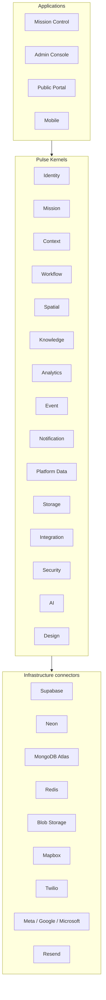
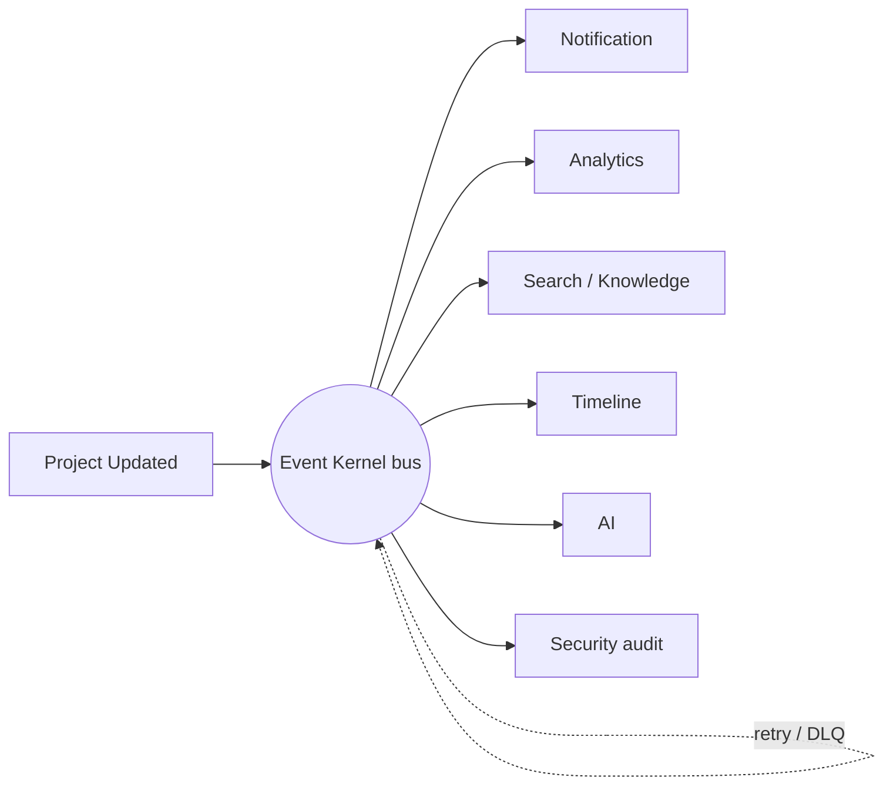
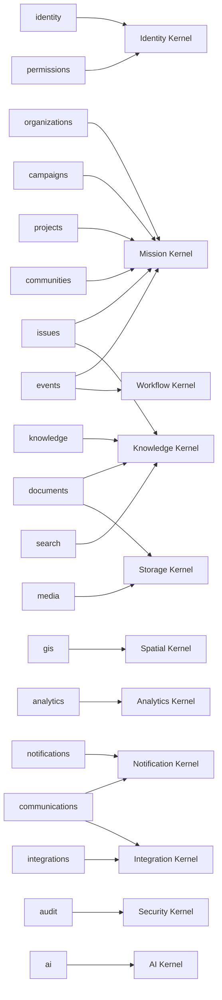

# Pulse Kernel Specification (Phase 2B.1.1)

**Status:** Architecture baseline — contracts + lifecycle implemented,
infrastructure deliberately mocked until phase 2B.1.4.

## Vision
Applications should be thin. Intelligence belongs inside the Kernel.

## Runtime layers
```text
Applications      Mission Control · Admin Console · Public Portal · Mobile
        ▲
Pulse Kernels     Identity · Mission · Context · Workflow · Spatial · Knowledge
                  Analytics · Event · Notification · Platform Data · Storage
                  Integration · Security · AI · Design
        ▲
Infrastructure    Supabase · Neon · MongoDB Atlas · Redis · Blob Storage
connectors        Mapbox · Twilio · Meta · Google · Microsoft · Resend
```
Nothing bypasses the kernel. Ever.

## Kernels
| Kernel | Purpose | Depends on |
| --- | --- | --- |
| Security | Encryption, secrets, policy, rate limits, audit | — |
| Platform Data | Repositories, transactions, cache, read/write models | security |
| Identity | Auth, sessions, RBAC/ABAC, membership, workspace switching | security, data |
| Context | Org / workspace / mission / geography / user / locale / theme / time | identity |
| Event | Domain events, queues, retries, dead letters | security |
| Mission | Organizations, workspaces, missions, programs, projects, communities | data, identity, context, event |
| Workflow | State machines, approvals, escalations, timers | event, mission, context |
| Knowledge | Indexing, versions, entity links, knowledge graph, RAG prep | data, storage, event |
| Spatial | Boundaries, layers, ingestion, spatial search, heatmaps | data, context, integration |
| Analytics | Aggregation, KPIs, trends, forecasts, summaries | data, event, context |
| Notification | Email, SMS, push, in-app, realtime | event, integration, context |
| Integration | Every external vendor behind one boundary | security, event |
| Storage | Documents, media, GIS, 3D, archives, versioning | security, data |
| AI | Prompt registry, embeddings, retrieval, context builder | knowledge, context, security |
| Design | Tokens, typography, color, spacing, motion, charts | context |

Each contract file declares `purpose`, `dependencies`, `publishes`,
`consumes` and `extensionPoints`, which are the machine-readable form of the
kernel contract checklist.

## Boot sequence
`resolveBootOrder()` topologically sorts the registry, producing:

```text
security → data → identity → context → event → mission → workflow → storage →
knowledge → integration → spatial → analytics → notification → ai → design
```

`bootKernel()` initializes modules in that order and hands each one a handle
that can resolve **only** its declared dependencies — an undeclared
`resolve()` throws. Shutdown drains the event bus, then tears modules down in
reverse order.

## Provider mode
`KernelConfig.providerMode` is `"memory"` through phases 2B.1.1–2B.1.3.
Unimplemented operations throw `NotImplementedYet` rather than silently
returning fake data, so gaps are explicit. Phase 2B.1.4 swaps adapters for
Supabase / Neon / MongoDB / Redis / blob storage without touching a single
domain or application module.

## Dependency rules (enforced or documented)
1. Applications may call only kernel APIs. *(convention + review)*
2. A kernel resolves only declared peers. *(enforced at boot)*
3. Dependency cycles are rejected. *(enforced by `resolveBootOrder`)*
4. Cross-kernel effects prefer the Event Kernel. *(convention)*
5. Adapters contain no business logic. *(convention + review)*

## Acceptance criteria status
- Documented contracts for every kernel — done.
- Explicit kernel dependencies — done, machine-readable.
- Applications depend only on kernel APIs — boundary established.
- Platform boots with mocked infrastructure — `bootKernel()` boots 15 modules.
- Real infrastructure attachable later without domain changes — adapter seam.

## Layer diagram



## Boot sequence diagram


## Event flow — nothing calls anything directly



## Domain contract modules mapped to kernels

27 domain contract modules live under `src/services/*/contracts.ts`. Each one
is a *bounded context* whose schemas must be consumed through exactly one
owning kernel. The 19 original modules are joined by 8 platform modules added
in 2B.1.1E so every kernel now has a contract home.


| # | Domain module | Owning kernel | Relationship |
| --- | --- | --- | --- |
| 1 | `identity` | Identity | direct — profiles, sessions |
| 2 | `permissions` | Identity | folds in — role grants are `PermissionEngine` inputs |
| 3 | `organizations` | Mission | direct — tenant root |
| 4 | `campaigns` | Mission | projection — missions of type `campaign` |
| 5 | `projects` | Mission | direct — projects under programs |
| 6 | `communities` | Mission | direct — constituency grouping |
| 7 | `issues` | Mission + Knowledge | mission-owned records, knowledge-indexed |
| 8 | `events` (calendar) | Mission + Workflow | scheduling belongs to Workflow timers |
| 9 | `documents` | Knowledge + Storage | metadata to Knowledge, bytes to Storage |
| 10 | `knowledge` | Knowledge | direct |
| 11 | `search` | Knowledge | folds in — search is a Knowledge capability |
| 12 | `media` | Storage | direct — assets and versions |
| 13 | `gis` | Spatial | direct — features, layers, boundaries |
| 14 | `analytics` | Analytics | direct — track + query |
| 15 | `notifications` | Notification | direct — in-app / push / realtime |
| 16 | `communications` | Notification + Integration | email/SMS via vendor adapters |
| 17 | `integrations` | Integration | direct — connector registry |
| 18 | `audit` | Security | folds in — `AuditLogger` read model |
| 19 | `ai` | AI | direct — completions |
| 20 | `missions` | Mission | direct — missions, phases, objectives, tasks (canonical) |
| 21 | `workflow` | Workflow | direct — definitions, instances, approvals, escalations, schedules |
| 22 | `context` | Context | direct — runtime context resolution + scoping |
| 23 | `data` | Platform Data | direct — query specs, cache keys, migrations, health |
| 24 | `event-bus` | Event | direct — publish/subscribe, queues, retries, dead letters |
| 25 | `security` | Security | direct — policies, secret refs, rate limits, audit, compliance |
| 26 | `design` | Design | direct — tokens, palettes, motion, accessibility contract |
| 27 | `storage` | Storage | direct — buckets, uploads, signed URLs, versions |




## Entity schemas added in 2B.1.1E

All shapes live in `@/packages/validators` and are composed by the domain
modules listed above. Nothing here touches infrastructure yet — these are the
contracts adapters must satisfy in 2B.1.3–2B.1.5.

| Area | Schemas | Consumed by |
| --- | --- | --- |
| Mission depth | `missionPhase`, `objective`, `task` (+ `objectiveStatus`, `taskStatus`, `taskPriority`) | `services/missions` → Mission Kernel |
| Identity depth | `invitation`, `mfaFactor`, `ssoConnection` (+ `roleName`, `mfaMethod`, `ssoProtocol`) | `services/identity` → Identity Kernel |
| Knowledge depth | `embedding`, `knowledgeGraphEdge` (+ `embeddingModel`, `graphEdgeKind`) | `services/knowledge` → Knowledge + AI Kernels |
| Spatial depth | `spatialIngestJob`, `tileLayer` (+ `spatialFormat`, `coordinateSystem`, `ingestJobStatus`) | `services/gis` → Spatial Kernel |
| Analytics depth | `metricQuery`, `series`, `forecastRequest`, `forecast`, `executiveSummary` | `services/analytics` → Analytics Kernel |

Validation rules worth noting:
- `objective.target`/`current` are unitful numbers; progress updates go through
  `updateObjectiveProgressRequest`, never a raw row write.
- `invitation.token` is opaque (16–256 chars) and never returned to list views.
- `secretReference.name` must be `UPPER_SNAKE`; secret *values* never cross a
  contract boundary.
- `spatialIngestJob.crs` defaults to `EPSG:4326`; ingest is asynchronous, so
  every job carries `status`, `featureCount` and `error`.
- `forecastRequest.horizonDays` is capped at 365 and every forecast point
  carries `lower`/`upper` confidence bounds.
- `workflow.scheduleRequest.cron` is regex-validated with an explicit timezone
  (default `Africa/Nairobi`).

## Adapter homes (`libs/*`)

Each empty barrel is now a typed adapter port. Kernels bind one implementation
at boot; domain code never imports a vendor SDK.

| Lib | Port | Providers planned |
| --- | --- | --- |
| `libs/database` | `DatabaseAdapter` (+ `databaseAdapters` registry) | memory, supabase, neon, mongo |
| `libs/cache` | `CacheAdapter`, `cacheKeyOf()` | memory, redis, kv |
| `libs/events` | `EventTransportAdapter`, `matchesPattern()` | memory, postgres outbox, redis streams, cf queues |
| `libs/queues` | `QueueAdapter`, `defaultRetryPolicy` | memory, cf queues, redis, pg-boss |
| `libs/security` | `EncryptionAdapter`, `SecretsAdapter`, `PolicyAdapter`, `RateLimiterAdapter`, `AuditSinkAdapter`, `timingSafeEqual()` | dev base64, WebCrypto AES-GCM, KMS |
| `libs/storage` | `StorageAdapter`, `objectPath()` | memory, supabase storage, R2, S3 |

## Boot smoke suite

`tests/kernel/kernel-boot.test.ts` (22 tests, `bun run test`, wired into
`.github/workflows/ci.yml`) asserts with in-memory adapters only:
acyclic registry and full kernel coverage, dependency-before-dependent boot
order (`security … design`), resolvable API + healthy report for all 15
kernels, rejection of undeclared cross-kernel resolution, fail-fast on a
missing module, security/data/context/event/queue/design round-trips,
dead-letter capture, `NotImplementedYet` for deferred operations, and
idempotent shutdown that releases every kernel.

## Gap analysis

### Kernels with no domain contract module yet
None. Every one of the 15 kernels now has a contract module (see the mapping
table). Remaining work is adapters, not contracts:

| Kernel | Status | Still outstanding |
| --- | --- | --- |
| Context | contracts + memory adapter | React provider + request-scoped propagation. 2B.1.3. |
| Workflow | contracts only | No engine: instances, timers and escalations are unimplemented. 2B.1.3. |
| Platform Data | contracts + memory repos | No migrations, read models or real providers. 2B.1.4. |
| Event | contracts + memory bus | No durable transport, retry execution or DLQ UI. 2B.1.5. |
| Security | contracts + memory adapter | Encryption is a base64 placeholder; policy store and compliance reporting unimplemented. 2B.1.4. |
| Design | contracts + memory adapter | Map palette + reduced-motion wiring; overlaps `packages/design-system`, `packages/theme`. 2B.1.2. |
| Storage | contracts only | Buckets not provisioned; no signed-URL implementation. 2B.1.4. |
| Mission | contracts only, adapter pending | `pending()` stubs throw; needs data-backed adapter. 2B.1.3. |

### Domain modules with no kernel home yet
None. All 27 map to an existing kernel, but three still need restructuring:
- `search` should become a Knowledge Kernel capability, not a peer service.
- `events` (calendar) splits: entities to Mission, scheduling to `workflow`.
- `communications` and `notifications` should collapse into one Notification
  Kernel surface with Integration adapters underneath.

### Cross-cutting gaps
- No kernel currently publishes health to an HTTP endpoint; `bootKernel().health()`
  exists but is not exposed under `/api/public/health`.
- `libs/*` adapter ports are declared but every registry is empty — binding
  real providers is 2B.1.4/2B.1.5 work.
- Applications still import `@/integrations/supabase/client` directly in
  `src/routes/_authenticated/route.tsx`; that is the one sanctioned bypass
  until the Identity Kernel adapter lands in 2B.1.3.


## Roadmap
| Phase | Scope |
| --- | --- |
| 2B.1.1 | Kernel contracts and lifecycle (this document) |
| 2B.1.2 | Design Kernel implementation |
| 2B.1.3 | Identity, Context, Mission, Workflow on mocked providers |
| 2B.1.4 | Platform Data Kernel with real databases |
| 2B.1.5 | Remaining kernels + event bus activation |

## Bootstrap REST API (kernel-only)

Four privileged endpoints let an operator stand a platform up with no UI. They
call kernel APIs exclusively — no table access, no vendor SDK in the route.

| Endpoint | Method | Kernels used |
| --- | --- | --- |
| `/api/platform/health` | GET | all (health probes) |
| `/api/platform/organizations` | GET, POST | Mission, Data |
| `/api/platform/invitations` | GET, POST, PATCH | Identity |
| `/api/platform/mission-flow` | POST | Mission, Workflow, Event, Context |

Every request must send `x-pulse-bootstrap-token`. Without the
`PULSE_BOOTSTRAP_TOKEN` secret configured the whole surface answers `503`.

`mission-flow` runs the full lifecycle — create mission → start
`mission.lifecycle` workflow → `plan` → `launch` (escalates) → `approve` →
`active` — and returns the emitted event trace.

## Live adapters

`src/kernel/adapters/live.server.ts` starts from the in-memory module set and
swaps in a live provider per kernel when its credentials exist:

| Provider | Kernel | Role |
| --- | --- | --- |
| Supabase Postgres | Data | transactional collections (orgs, workspaces, missions, invitations, workflow instances, assets) |
| Neon HTTP | Data | analytical collections (`analyticsEvents`, `metricSnapshots`, `spatialFeatures`) |
| Redis (REST) | Data, Event | cache + durable queues |
| Cloud Storage | Storage | blobs, signed URLs, versioned asset metadata |
| Mapbox | Spatial | geocoding, boundaries, tilesets |

A missing credential degrades that one kernel to memory and is reported by the
health endpoint; the platform always boots. Collection→provider routing is
resolved by `DataKernelApi.providerFor`, so domain code never names a database.
